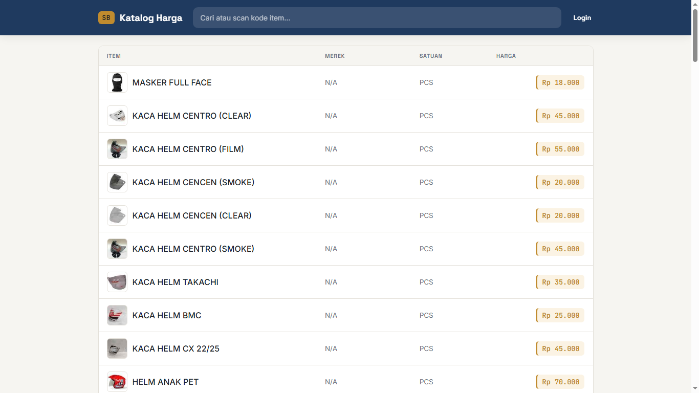
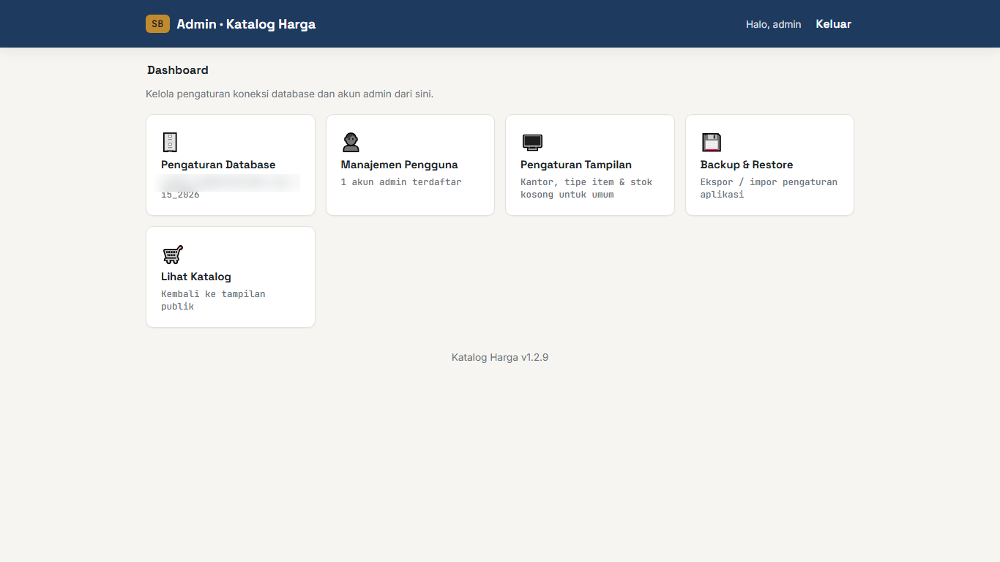
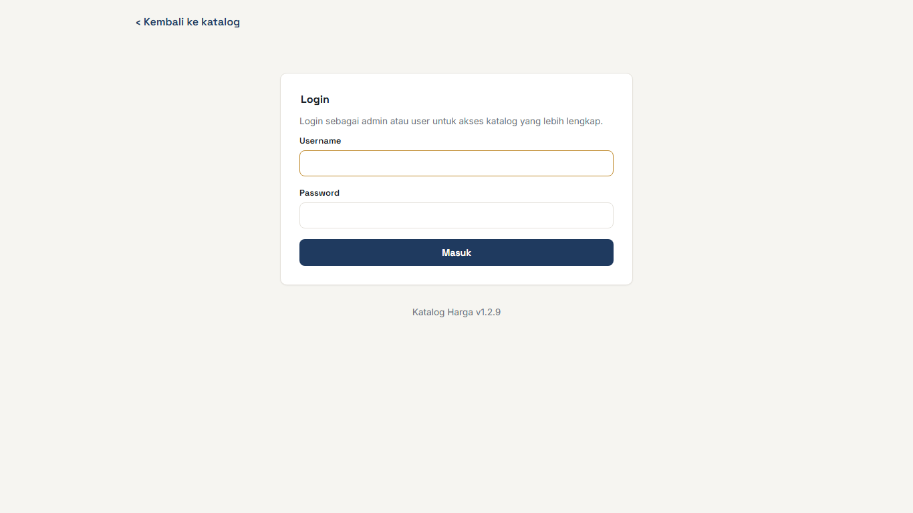

# Katalog Harga iPos5
Katalog Harga versi web untuk aplikasi POS iPos5 — pencarian item, harga & stok per kantor/gudang, plus panel admin.

## Fitur
- Cari & scan item (nama, merek, kode, jenis, barcode), lengkap gambar & harga.
- Pilih kantor/gudang aktif, harga & stok menyesuaikan otomatis.
- Halaman detail per item: harga per satuan, barcode, dan stok.
- Panel admin: koneksi database, akun pengguna, pengaturan tampilan katalog.
- Bisa di-install sebagai app lewat browser (PWA) — "Add to Home Screen"
  untuk akses satu tap tanpa address bar. Halaman katalog/detail tetap
  selalu ambil data terbaru (tidak di-cache offline), cuma aset statis
  (CSS/font/ikon) yang di-cache untuk load lebih cepat.

## Screenshot

| Katalog publik | Panel Admin | Login |
|---|---|---|
|  |  |  |

## Peran pengguna
| Peran | Login? | Akses |
|---|---|---|
| **Admin** | Ya | Katalog lengkap + panel admin. |
| **User** | Ya | Katalog lengkap, tanpa akses panel admin. |
| **Umum** | Tidak | Katalog sesuai pengaturan admin, tidak bisa ganti kantor. |

Tombol **Login** ada di pojok kanan atas. Akun pertama yang dibuat otomatis jadi admin.

## Instalasi
1. Deploy ke server PHP yang mendukung `pdo_pgsql` dan `pdo_sqlite`.
2. Pastikan folder `data/` bisa ditulis web server.
3. Buka `admin/login.php`, buat akun admin pertama.
4. Atur koneksi database di **Panel Admin -> Pengaturan Database**.
5. (Opsional) Atur tampilan katalog & tambah akun `user`.

### Instalasi dengan Docker
Cara tercepat menjalankan aplikasi tanpa setup PHP manual.

1. Pastikan [Docker](https://docs.docker.com/get-docker/) & Docker Compose sudah terpasang.
2. Dari folder project, jalankan `docker compose up -d --build`.
3. Buka `http://localhost:8080` (mengarah ke `maintenance.php` sampai database katalog di-setting), lalu `http://localhost:8080/admin/login.php` untuk buat akun admin pertama.
4. Atur koneksi database di **Panel Admin -> Pengaturan Database**.

Data pengaturan & akun (`data/settings.db`) disimpan di volume `katalog-data`. Kelola dengan `docker compose logs -f`, `docker compose down`, atau `docker compose down -v` (reset total).

## Performa

- **Cache gambar** — `image.php` menyimpan produk & thumbnail di `data/img-cache/` setelah pertama diambil, jadi request berikutnya tidak buka koneksi PostgreSQL. Kalau foto produk diganti di iPos5 (kode item sama), bersihkan lewat **Panel Admin -> Pengaturan Tampilan -> Bersihkan cache gambar**.
- **Index database** — query katalog & detail sudah dioptimalkan (LATERAL join, tanpa N+1), tapi kecepatan tetap tergantung index PostgreSQL. Kalau terasa lambat, jalankan `EXPLAIN ANALYZE` dan pertimbangkan index pada `tbl_itemstok(kantor, kodeitem)`, `tbl_item(jenis)`, `tbl_itemhj(kodeitem, satuan)`, `tbl_itemsatuanjml(kodeitem)` — atau index trigram (`pg_trgm`) untuk pencarian `ILIKE` di katalog besar.
- **OPcache & kompresi** — aktif otomatis lewat Dockerfile. Deploy native: aktifkan opcache di `php.ini` dan `a2enmod deflate expires headers` + `AllowOverride All` supaya `.htaccess` terbaca.

## Kebutuhan sistem
- PHP dengan ekstensi `pdo_pgsql`, `pdo_sqlite`
- Database katalog: PostgreSQL (iPos5)
- (Opsional) Docker & Docker Compose

## Changelog
Lihat [CHANGELOG.md](CHANGELOG.md).
